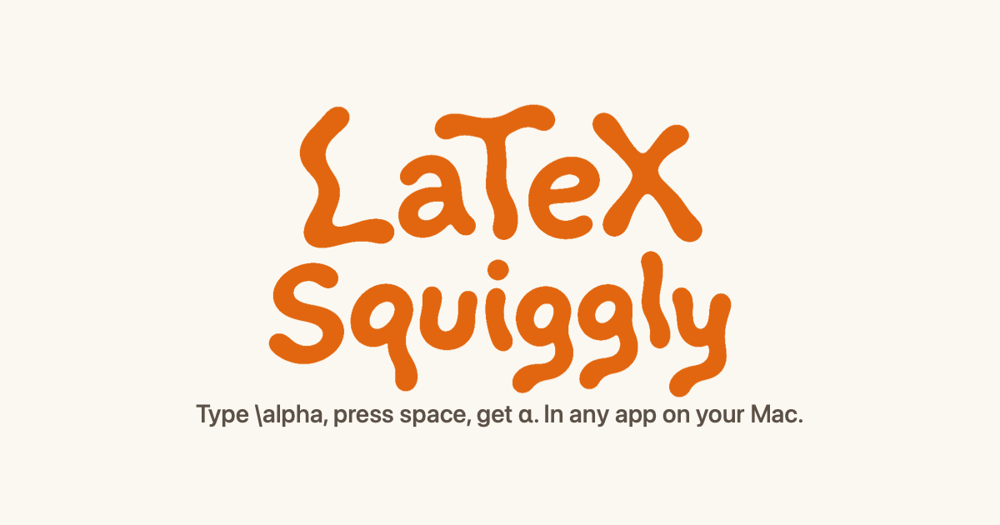
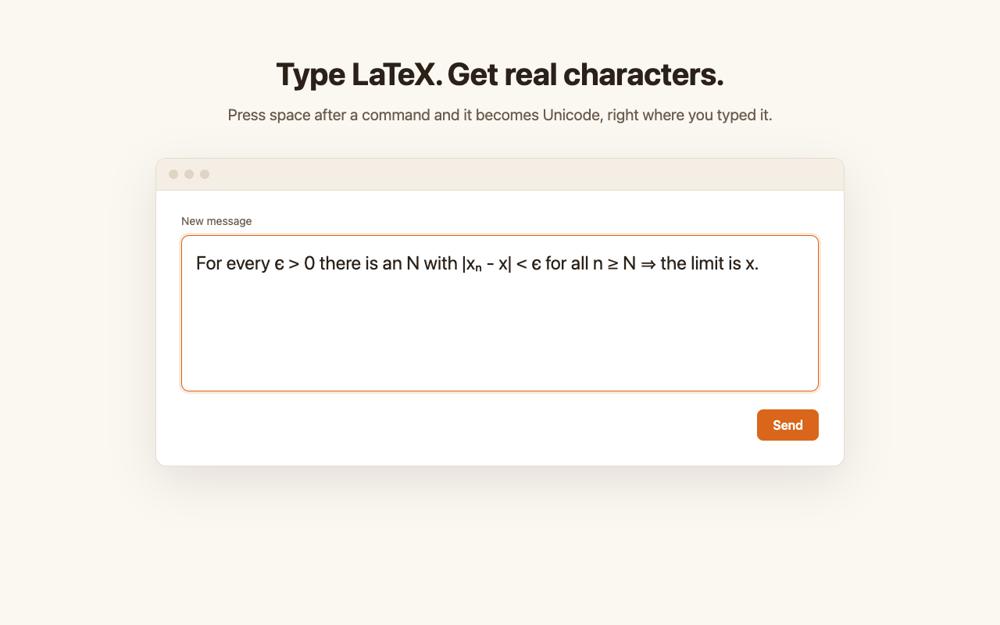
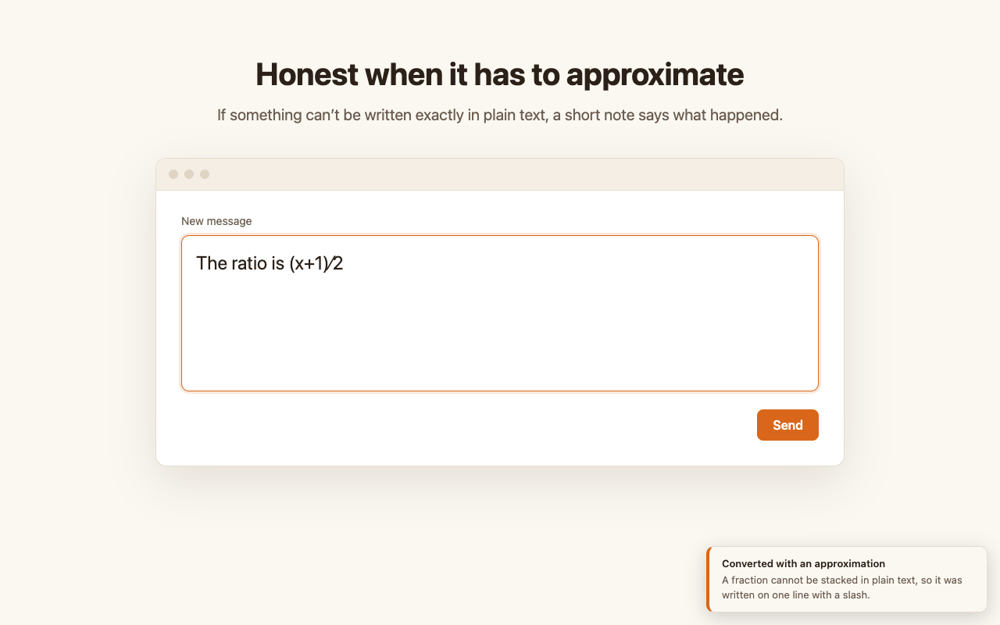
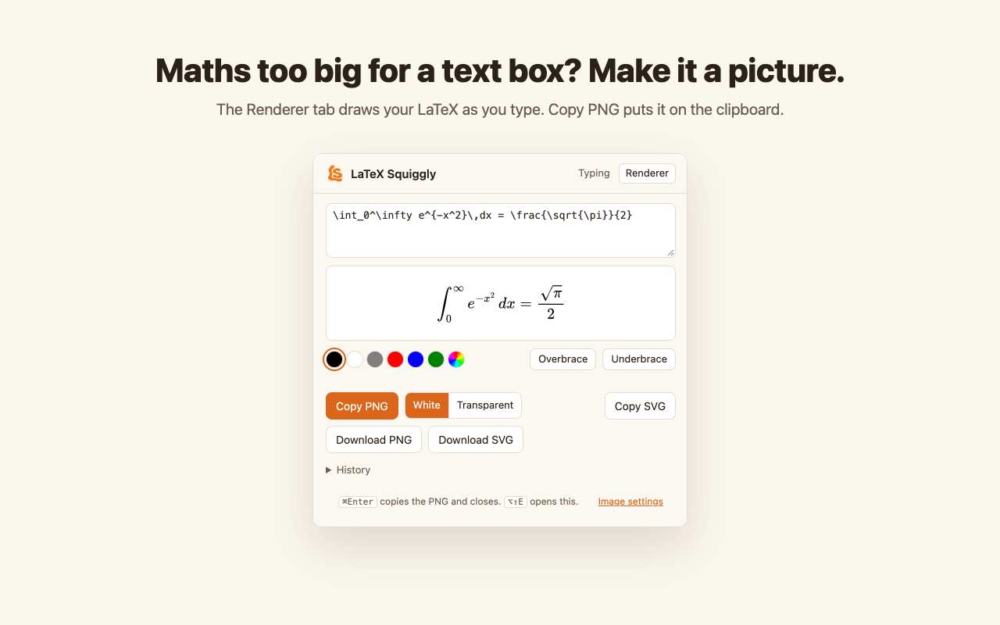
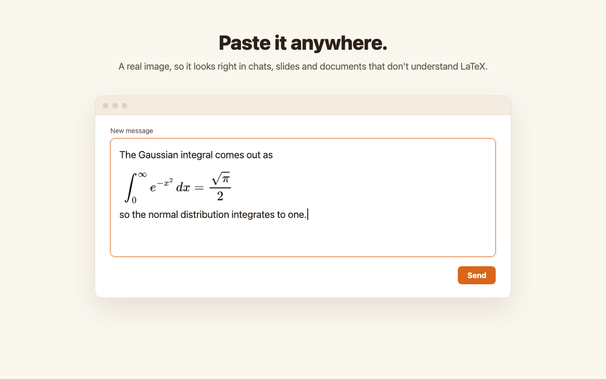

  

  <b>Type LaTeX anywhere. Get real characters.</b>

  
  
  

You can't paste LaTeX into a chat, an email or a comment box. LaTeX Squiggly
lets you type it anyway. Type `\alpha`, press space, and the letters you just
typed become α, right where you typed them. The result is ordinary Unicode
text, so it survives copying and pasting into anything.

It runs as a menu bar app on macOS, a tray app on Windows and a Chrome
extension. **[Try it in your browser](https://superwalrus01.github.io/LaTeX-Squiggly/#try)**
before installing anything.

| You type | You get |
|---|---|
| `\alpha` `\Rightarrow` `\leq` `\in` | α ⇒ ≤ ∈ |
| `$x^2$` `$a_1$` | x² a₁ |
| `\int_0^1` `\sum_{i=1}^{n}` | ∫₀¹ ∑ᵢ₌₁ⁿ |
| `\frac{1}{2}` `\frac{10}{17}` | ½ ¹⁰⁄₁₇ |
| `\mathbb{R}` | ℝ |
| `\frac{x+1}{2}` | (x+1)∕2, with a note that it had to be written on one line |
| `\vec{v}` | left as typed, with a note saying why |

202 symbols, plus superscripts, subscripts, fractions, roots and binomials.
When something has no exact Unicode form, it says so instead of guessing, and
it never leaves a half-converted result.

Maths that plain text cannot hold, like a stacked fraction or a matrix, can be
turned into an image instead: the Mac app and the Chrome extension have a
renderer that copies your LaTeX as a PNG, ready to paste. The
[guide](https://superwalrus01.github.io/LaTeX-Squiggly/guide.html) walks
through both.

## Screenshots

<table>
  <tr>
    <td width="50%"></td>
    <td width="50%"></td>
  </tr>
  <tr>
    <td width="50%"></td>
    <td width="50%"></td>
  </tr>
</table>

## Install

| Platform | How |
|---|---|
| **macOS** 13+ | Download the `.dmg` from the [latest release](https://github.com/SuperWalrus01/LaTeX-Squiggly/releases/latest) and drag the app to Applications, or [build it from source](docs/macos.md#installing). |
| **Windows** 10+ *(beta)* | Download the `.exe` from the [releases](https://github.com/SuperWalrus01/LaTeX-Squiggly/releases) and double-click it. No installer, no admin rights. See [windows/](windows/README.md). |
| **Chrome** | Coming to the Chrome Web Store. Until then, [load it unpacked](chrome/README.md#trying-it-locally). |

Neither desktop app is signed with a paid certificate, so macOS and Windows
each show a warning the first time. The platform guides above say exactly what
you will see and what to click.

## Where it stays quiet

In a `.tex` file or on Overleaf, `\alpha` has to stay `\alpha`. So LaTeX
Squiggly does nothing in TeX editors, code editors and terminals, or on
Overleaf and other LaTeX websites, and you can add any app or site to that
list. It also stays silent on ordinary typing that happens to contain a
backslash, like `C:\Users\`.

## Privacy

To recognise a command, LaTeX Squiggly keeps the last few characters you typed,
in memory only, and forgets them whenever you click, press an arrow key or
switch apps. Nothing you type is stored or sent anywhere, and no part of it
makes a network request. The source is here so you can check. See the
[privacy policy](https://superwalrus01.github.io/LaTeX-Squiggly/privacy.html).

## Documentation

- [The guide](https://superwalrus01.github.io/LaTeX-Squiggly/guide.html): how
  to use it on each platform, for people using it rather than working on it.
- [How the platforms fit together](docs/architecture.md): one Swift engine,
  with the Windows and Chrome versions generated from it and checked against it
  over 2,030 fragments.
- [The engine](docs/engine.md): what converts, and why it decides what it does.
- [The Mac app](docs/macos.md), [the Windows app](windows/README.md) and
  [the Chrome extension](chrome/README.md).
- [Changelog](CHANGELOG.md).

## Contributing

Bug reports and symbol requests are welcome as
[issues](https://github.com/SuperWalrus01/LaTeX-Squiggly/issues/new/choose).
[CONTRIBUTING.md](CONTRIBUTING.md) explains how the repository is organised and
how to make a change; `scripts/check-all.sh` runs every check before you push.

## Licence

[MIT](LICENSE). The only third-party code is MathJax 3.2.2, under the Apache
License 2.0, bundled in `chrome/renderer/mathjax/` for the renderer. The symbol
table was not copied from `unicode-math` or the W3C entity tables:
`scripts/generate-swift-tables.py` pairs each command with a Unicode character
*name* and resolves it against the Unicode database when it runs.
